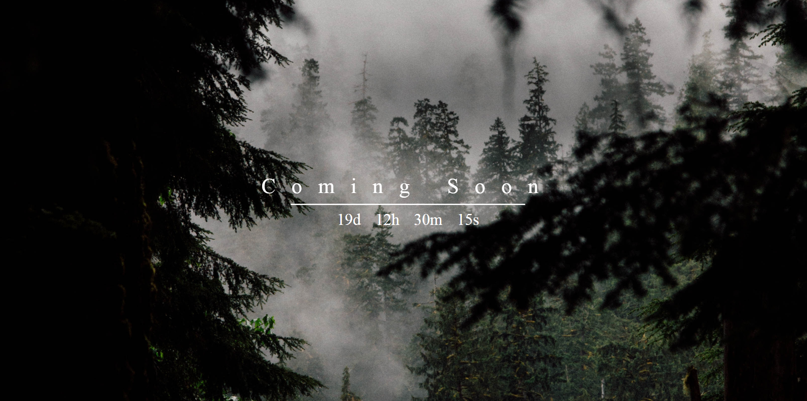

# Langing page 

## Table of contents
* [General info](#general-info)
* [Screenshots](#screenshots)
* [Technologies](#technologies)
* [Setup](#setup)
* [Status](#status)

## General info
Landing page. In this project I use  HTML5, CSS3 and JavaScript (ECMAScript6).

## Screenshots
;

## Technologies
* HTML5
* CSS3 
* JavaScript (ECMAScript6)

## Setup
Click on this link:  https://igor27g.github.io/Landing_page/

## Status
Project is: _finished_.

